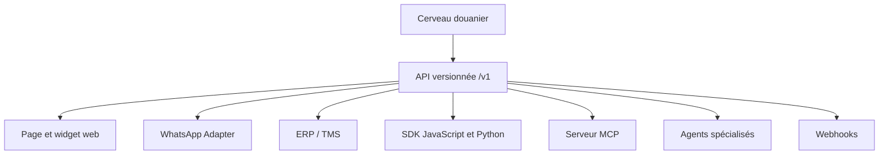

# Sorties plug-and-play

Statut : architecture validée.

## Principe

Le cerveau est headless. Une page web, WhatsApp, un ERP ou un agent utilise la
même API et reçoit le même résultat canonique. L'adaptateur change la présentation,
jamais la règle métier.

## Contrats obligatoires

Chaque réponse contient `request_id`, statut, juridiction, date applicable,
résultats structurés, niveau `confirmed|probable|ambiguous|unknown`, informations
manquantes, avertissements et preuves. Les contrats sont décrits en OpenAPI et
versionnés sans rupture silencieuse.

## Capacités exposées

- `classify_product`
- `get_hs_hierarchy`
- `get_applicable_rates`
- `get_required_authorizations`
- `get_required_documents`
- `get_origin_rules`
- `get_applicable_law`
- `build_customs_route`
- `compare_legal_versions`
- `explain_with_sources`

## Agents

Les agents SH, juridique, tarifaire, origine, autorisations, dossiers et veille
utilisent tous les mêmes outils. Un orchestrateur assemble leurs résultats. Chaque
agent possède mission, outils, scopes, budget, version, tests et journal d'audit.

## Sessions multicanales

Une conversation transporte `organization_id`, `user_id`, `channel`,
`conversation_id`, `request_id`, `case_id`, langue et permissions. Un dossier
commencé sur WhatsApp peut être repris sur le web sans perdre ses preuves.

## Sécurité

OAuth ou clés serveur pour les partenaires, jetons courts, scopes, quotas,
signatures de webhooks, idempotency keys et audit. Aucun secret serveur ni accès
direct aux tables canoniques n'est exposé au navigateur ou aux agents.

