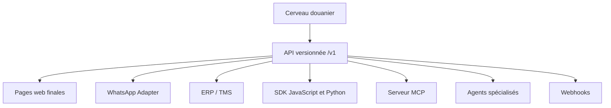

# Sorties plug-and-play

Statut : architecture validée.

## Principe

Le cerveau est headless. Une page web, WhatsApp, un ERP ou un agent utilise la
même API et reçoit le même résultat canonique. L'adaptateur change la présentation,
jamais la règle métier. WhatsApp est obligatoire dans la V1 Maroc : il doit être
conçu comme un canal principal pour poser une question, suivre un dossier et
recevoir les preuves, pas comme une option marketing ajoutée plus tard.

La page web n'est pas le produit ; elle est un canal consommateur. La refonte
complète des pages web, admin et utilisateur est obligatoire, mais elle arrive
dans l'ordre de construction après la data, le contexte, le moteur de décision,
l'API `/v1` et les agents métier. Les pages créées avant cette étape servent
uniquement à l'administration du corpus, au contrôle qualité et à la revue.

```mermaid
flowchart TB
  B[Cerveau douanier] --> API[API versionnée /v1]
  API --> WEB[Pages web finales]
  API --> WA[WhatsApp Adapter]
  API --> ERP[ERP / TMS]
  API --> SDK[SDK JavaScript et Python]
  API --> MCP[Serveur MCP]
  API --> AG[Agents spécialisés]
  API --> HOOK[Webhooks]
```

## Ordre de construction des canaux

1. Construire le cerveau et ses contrats API.
2. Brancher les agents métier SH, juridique et opérations pour valider les
   sorties du cerveau.
3. Exposer les SDK, MCP, webhooks et intégrations serveur.
4. Construire l'adaptateur WhatsApp obligatoire sur les mêmes contrats : session,
   dossier, preuves, reprise web et limites de sécurité.
5. Construire les pages web finales, admin et utilisateur, comme expérience
   complète au-dessus de ces mêmes contrats.
6. Ajouter ensuite ERP/TMS et autres intégrations partenaires.

## Contrats obligatoires

Chaque réponse contient `request_id`, statut, juridiction, date applicable,
résultats structurés, niveau `confirmed|probable|ambiguous|unknown`, informations
manquantes, avertissements et preuves. Les contrats sont décrits en OpenAPI et
versionnés sans rupture silencieuse.

## Capacités exposées

- `classify_product`
- `get_hs_hierarchy`
- `get_applicable_rates`
- `get_required_authorizations`
- `get_required_documents`
- `get_origin_rules`
- `get_applicable_law`
- `build_customs_route`
- `compare_legal_versions`
- `explain_with_sources`

## Agents

Les agents SH, juridique, tarifaire, origine, autorisations, dossiers et veille
utilisent tous les mêmes outils. Un orchestrateur assemble leurs résultats. Chaque
agent possède mission, outils, scopes, budget, version, tests et journal d'audit.

## Sessions multicanales

Une conversation transporte `organization_id`, `user_id`, `channel`,
`conversation_id`, `request_id`, `case_id`, langue et permissions. Un dossier
commencé sur WhatsApp peut être repris sur le web sans perdre ses preuves.

## WhatsApp obligatoire V1

L'adaptateur WhatsApp doit permettre au minimum : création d'une demande,
qualification produit/opération/origine, récupération d'un dossier existant,
réponse sourcée courte, envoi d'une checklist, demande de complément, escalade
vers revue humaine/admin quand le cerveau répond `ambiguous` ou `unknown`, et
journal d'audit identique au web. WhatsApp ne porte aucune règle métier : il
appelle l'API `/v1` et affiche les résultats du cerveau.

## Refonte obligatoire des pages

La V1 doit remplacer les pages génériques actuelles par des pages métier branchées
sur l'API : recherche SH, parcours import/export, exploration juridique sourcée,
dossier client, génération de checklist/note, revue qualité admin, ingestion/admin
data, relations juridiques et réglementaires. Les pages admin et utilisateur ne
lisent pas directement les tables canoniques et ne dupliquent pas les règles.

## Sécurité

OAuth ou clés serveur pour les partenaires, jetons courts, scopes, quotas,
signatures de webhooks, idempotency keys et audit. Aucun secret serveur ni accès
direct aux tables canoniques n'est exposé au navigateur ou aux agents.

