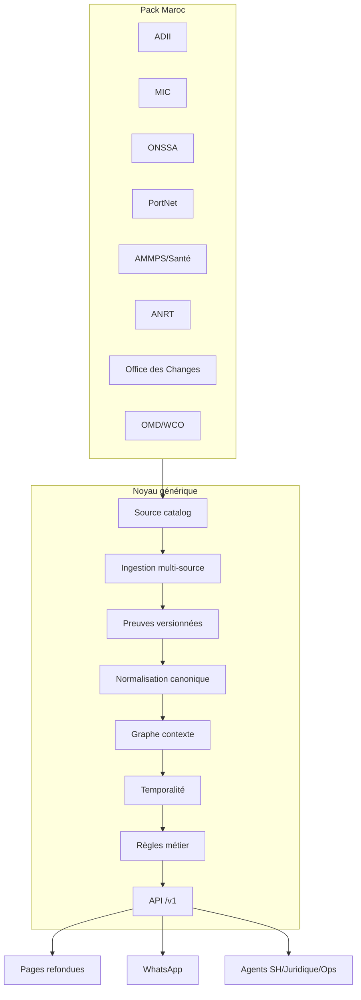

# Audit code actuel et backlog V1 Maroc

Statut : document de pilotage après validation de l'architecture `noyau générique +
pack Maroc + ingestion multi-source`. Dernière mise à jour : 27 septembre 2026.

Ce document audite l'existant et transforme l'audit sources/obligations en
chantiers de développement bornés pour livrer la V1 Maroc sans dette documentaire.

## Résumé exécutif

Le dépôt contient déjà un socle sérieux, mais il mélange deux générations de
modèle :

1. **Legacy métier utile** : tables `country_tariffs`, `controlled_products`,
   `legal_chunks`, `hs_codes`, `consultations`, fonctions chat/RAG et rapports.
   Cette couche a permis de construire une app opérationnelle, mais elle porte
   des hypothèses Maroc et des lectures directes de tables qui ne doivent plus
   être étendues pour la V1.
2. **Cerveau canonique récent** : `source_documents`, `source_pages`,
   `ingestion_jobs`, `page_engine_outputs`, `tariff_*_candidates`,
   `legal_*`, `hs_nodes`, `regulatory_measures`, `business_rules`, dossiers,
   preuves, audit et publication contrôlée. C'est la couche à consolider.

La stratégie V1 est donc : **ne pas jeter l'existant**, mais interdire les
nouvelles fonctions métier sur le legacy. Les données legacy peuvent être lues
pour migration ou comparaison, puis tout fait publié doit passer par le modèle
canonique.

## Inventaire de l'existant

| Bloc | Ce qui existe | Décision V1 |
| --- | --- | --- |
| Frontend public/app | Landing, accès, chat, consultation, historique, dossiers, détail dossier, juridique, SH, produits | Refonte obligatoire après API `/v1`. Les pages actuelles restent temporaires pour démonstration et administration légère. |
| Frontend admin | Upload, documents, corpus, qualité pages, juridique, versions, relations, revue SH, contexte réglementaire, accès | Garder pour qualité data, mais les écrans finaux doivent appeler des RPC/API métier au lieu de manipuler directement les tables. |
| Auth et organisations | Supabase Auth, demandes d'accès, approbation admin, organisations/membres, RLS partielle | À conserver et durcir. Ajouter scopes canal/API pour WhatsApp et agents. |
| Legacy SH/tarif | `hs_codes`, `country_tariffs`, `tariff_notes`, embeddings, recherche hybride | Ne plus étendre comme source de vérité. Migrer/benchmarker vers `hs_nomenclatures`, `hs_nodes`, `tariff_*_candidates`, `regulatory_measures`. |
| Legacy contrôles | `controlled_products`, ANRT approved/dispensed, fonctions import ANRT | Réutiliser comme données d'amorçage uniquement. Normaliser vers `regulatory_measures`, `authority_catalog`, `authorization/control_requirements`. |
| Legacy juridique/RAG | `legal_sources`, `legal_chunks`, recherche hybride, chat Edge Function | Garder comme fallback de consultation. La V1 doit interroger les faits canoniques et retourner `unknown` si absent. |
| Ingestion corpus | SHA-256, source assets, source documents/pages, jobs, diagnostics, engine outputs, fusion, corrections | À conserver. Étendre vers source adapters multi-format et registre officiel de sources. |
| OCR/layout | Worker Node, gateway, tokens courts, Poppler/Tesseract/PDFium, page fusion | À finaliser en production durable. |
| Extraction SH | Worker tarifaire et tables candidats tableau/ligne/cellule | À exécuter sur P0, mesurer, puis promouvoir vers faits canoniques. |
| Extraction juridique | Candidats, benchmark, staging, promotion draft, revue hiérarchique, 1 768 provisions validées, 10 relations proposées | À étendre RDII/circulaires/lois et compléter relations/dates. |
| Publication contrôlée | Guards de publication, revue, blocage preuves insuffisantes | À conserver et appliquer à toutes les familles de faits. |
| API cerveau | Contrats TypeScript partiels dans `src/lib/customs-brain/contracts.ts` | À transformer en `/v1` OpenAPI + RPC/Edge Functions stables. |
| Agents/WhatsApp | Non implémentés comme canaux V1 | À construire après API stable. |

## Dette documentaire et technique à résoudre

| Dette | Risque | Résolution V1 |
| --- | --- | --- |
| Deux modèles de données parallèles | Réponses différentes selon la page ou l'agent | Déclarer legacy en lecture/migration ; nouvelle V1 sur canonique uniquement |
| Fonctions chat/RAG hors API cerveau | Le LLM peut présenter du contexte non publié | Construire API `/v1` avec statut `confirmed/probable/ambiguous/unknown` et preuves |
| Pages lisant directement Supabase | Logique métier dupliquée, sécurité et incohérence | Pages finales consomment API `/v1`; admin data peut utiliser RPC contrôlées |
| Ingestion orientée surtout PDF | MIC/ONSSA/PortNet/ANRT publient pages, tableaux Excel/CSV et portails | Ajouter adapters source multi-format, dont `spreadsheet_importer`, et type de contenu |
| Modèle `regulatory_measures` trop général pour toutes les obligations | Difficile de représenter procédure, document, autorisation et contrôle | Étendre par tables spécialisées ou sous-types normalisés |
| Source catalog P0 non matérialisé en base | Mise à jour/surveillance non pilotables | Ajouter `jurisdiction_packs`, `authority_catalog`, `source_catalog`, `source_connector_configs` |
| Publication juridique sans cibles complètes | Relations utiles mais non validables | Résoudre versions cibles, dates d'effet et sources avant validation |
| Tests qualité incomplets sur vérité terrain | Impossible de promettre 98 % | Construire scénarios P0 et seuils CI qualité |

## Architecture V1 validée

### Statut chantier 1 — registre générique et pack Maroc

La migration `supabase/migrations/20260927220000_jurisdiction_source_catalog.sql` matérialise le registre attendu : pack juridictionnel, autorités, sources officielles et configurations de connecteurs. Elle charge le pack Maroc V1 avec 12 autorités et 17 sources, dont les sources P0 ADII, PortNet, MIC, ONSSA, AMMPS, Santé, ANRT et Office des Changes. WCO/OMD est présent comme source P1 bloquée tant que la licence n'est pas clarifiée.

Le 27 septembre 2026, la migration a été appliquée via Supabase SQL Editor puis vérifiée par lecture MCP. Les quatre tables existent en production et contiennent 1 pack, 12 autorités, 17 sources, 16 sources P0 et 17 connecteurs. La couche applicative `src/lib/customs-brain/source-registry.ts` est alignée sur la taxonomie réelle des connecteurs : `direct_pdf_fetcher`, `pdf_link_extractor`, `portal_index_monitor`, `html_crawler` et `blocked`.

## Backlog V1 Maroc borné

Un chantier est `done` uniquement si son critère de fin est mesuré dans
`CURRENT_STATE.md`.

| Ordre | Chantier V1 | État | Critère de fin mesurable |
| ---: | --- | --- | --- |
| 0 | Audit sources/obligations Maroc | done | `MOROCCO_SOURCE_OBLIGATION_AUDIT.md` créé et relié à la documentation |
| 1 | Alignement modèle noyau + pack Maroc | done | tables `jurisdiction_packs`, `authority_catalog`, `source_catalog`, `source_connector_configs` créées ; 1 pack, 12 autorités, 17 sources, 16 P0 et 17 connecteurs vérifiés en production |
| 2 | Source adapters multi-format | in_progress | plans adapters V1 livrés/testés pour 17 sources Maroc ; Excel/CSV intégré via `spreadsheet_importer` générique ; audit `source_discovery_runs` appliqué ; prochain cran : enregistrer assets, versions, statut accès et preuves en base |
| 3 | Ingestion P0 Maroc | in_progress | toutes les sources P0 ont au moins une stratégie : auto, semi-auto validée, manuel versionné ou bloqué documenté |
| 4 | OCR/layout/fusion production | in_progress | 100 % pages P0 ont état terminal ; pages faibles traitées ou quarantaine justifiée |
| 5 | SH/tarif canonique | in_progress | tarif P0 extrait en candidats ligne/cellule, benchmark code-libellé-unité-taux atteint, promotion canonique contrôlée |
| 6 | Juridique ADII complet | in_progress | Code douanes, RDII, circulaires/lois finance P0 structurés, dates/relations critiques proposées et revues |
| 7 | Obligations MIC/ONSSA/ANRT/AMMPS/Office Changes | todo | licences, contrôles, documents, procédures et autorités P0 normalisés en mesures réglementaires sourcées |
| 8 | Graphe contexte SH–juridique–obligations | todo | pour un SH ou produit, le graphe retourne textes, taxes, autorisations, contrôles, documents, procédure et preuves |
| 9 | Compilateur temporel et priorités | todo | `operation + product + origin + date` résout la règle applicable, version et statut d'incertitude |
| 10 | Jeu de référence V1 | todo | scénarios électronique Wi-Fi, alimentaire, médicament, industriel normé, céréale, licence, export agro validés |
| 11 | API cerveau `/v1` | todo | OpenAPI, contrats et tests pour classify, rates, authorizations, documents, law, route |
| 12 | Agents métier | todo | agents SH, juridique, opérations utilisent uniquement `/v1` et ne créent aucune règle |
| 13 | WhatsApp obligatoire | todo | création/reprise dossier, question, checklist, preuves, escalade et audit via `/v1` |
| 14 | Refonte pages web/admin/utilisateur | todo | toutes pages finales consomment `/v1`; admin data utilise RPC contrôlées ; legacy non exposé comme vérité |
| 15 | Sécurité, observabilité, publication | in_progress | RLS/scopes, logs, jobs, publication gates, rollback, CI qualité et monitoring Vercel/Supabase actifs |

## Ordre de développement recommandé

1. Matérialiser en base le **registre des sources et autorités** du pack Maroc.
2. Étendre l'ingestion pour les **sources multi-format** sans casser le pipeline PDF : HTML, PDF, portail, RSS quand disponible, Excel/CSV et dépôt manuel versionné.
3. Finir la **promotion SH/tarif canonique**, car le parcours douanier dépend du SH.
4. Étendre la **base juridique ADII** aux textes P0 manquants.
5. Ingestions P0 non-ADII : MIC, ONSSA, ANRT, AMMPS, Office des Changes.
6. Construire le **graphe contexte** reliant SH, textes, mesures, documents et procédures.
7. Construire API `/v1`, puis agents, WhatsApp et refonte pages.

## Interdictions V1

- Ne plus ajouter de logique métier dans `supabase/functions/chat` ou dans les pages.
- Ne plus publier un fait depuis une table legacy sans migration vers le modèle
  canonique, preuve, statut, date et source.
- Ne pas coder de règle Maroc dans le noyau ou l'interface.
- Ne pas automatiser les formalités PortNet transactionnelles sans API/autorisation ;
  la V1 modélise la procédure et les exigences.
- Ne pas promettre un taux de fiabilité sans scénario de référence.

## Sortie attendue de la V1

Pour une demande composée de `produit + opération + origine + destination + date`,
le cerveau doit retourner :

- classification SH candidate et alternatives ;
- droits/taxes/taux et conditions ;
- textes juridiques applicables ;
- autorisations/licences/contrôles ;
- documents requis ;
- procédure et canal ;
- risques et incertitudes ;
- preuves exactes ;
- statut `confirmed`, `probable`, `ambiguous` ou `unknown` ;
- `case_id` partageable entre web et WhatsApp.
