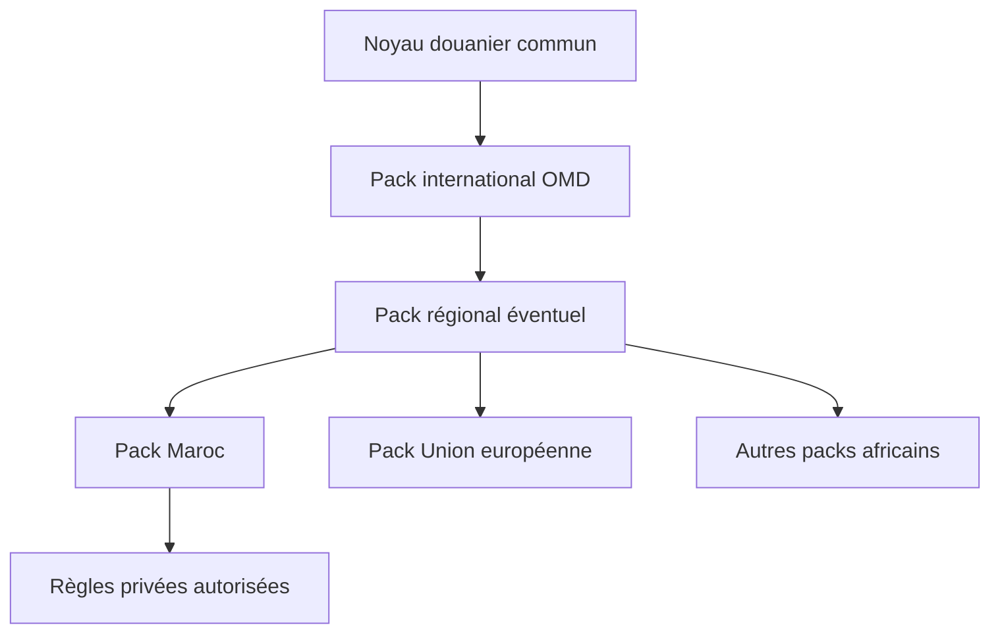

# Noyau et packs de juridiction

Statut : architecture validée.

## Décision

Douane AI utilise un noyau indépendant des pays et des packs versionnés par
juridiction. Le Maroc est le premier pack complet. Ajouter un pays ne doit ni
dupliquer le pipeline ni modifier les contrats de l'API.

## Noyau commun

Le noyau porte les sources, preuves, versions, modèle SH, modèle juridique,
temporalité, graphe, règles, qualité et contrats d'accès. Il ne contient aucune
valeur, administration ou procédure propre au Maroc.

## Pack international

Il porte les éditions SH à six chiffres et les instruments internationaux dont
les droits de réutilisation sont confirmés. Les outils OMD restreints restent
exclus tant que la licence ne permet pas leur ingestion.

## Pack Maroc

Le pack `MA` doit couvrir :

- extensions nationales SH à huit et dix chiffres ;
- désignations, unités, droits, TVA, taxes et formules ;
- Code des douanes et impôts indirects ;
- RDII et annexes ;
- circulaires, notes et instructions ;
- lois, décrets et arrêtés applicables ;
- accords préférentiels et règles d'origine ;
- autorisations, prohibitions et contrôles techniques ;
- administrations et organismes compétents ;
- procédures, délais et documents exigés ;
- contentieux, exceptions et sanctions lorsque sourcés.

## Héritage et priorité

Une règle nationale complète ou surcharge une règle héritée uniquement avec une
base juridique explicite. La résolution tient compte de la juridiction, du
territoire, de l'opération, de l'origine, de la destination, du régime, du code
SH, de l'accord et de la date.

## Contrat d'un pack

Chaque pack fournit un registre de sources, une taxonomie, des extracteurs, des
mappings vers le noyau, ses règles de priorité, ses tests de référence, ses
migrations et un rapport de couverture. Il possède une version indépendante.

