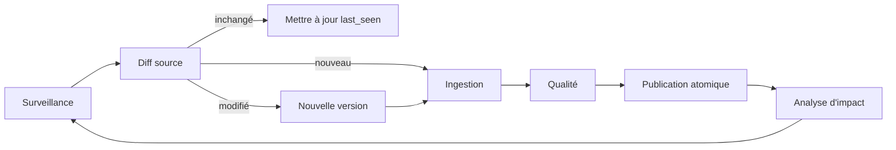

# Pipeline d'ingestion

## États

```text
discovered -> downloaded -> diagnosed -> extracting -> normalized
-> quality_check -> ready_for_publication -> published
                         \-> retryable_failure -> extracting
                         \-> quarantined
```

Un échec sur un document n'arrête jamais le corpus. Une tâche conserve son entrée,
sa version de pipeline, ses tentatives, son erreur structurée et sa prochaine action.

## Étapes obligatoires

### 1. Découverte

Enregistrer fournisseur, identifiant externe, URL, chemin, horodatages, MIME,
taille, ETag ou révision et date d'observation. Ne télécharger que les ressources
nouvelles ou modifiées.

### 2. Acquisition immuable

Télécharger dans une zone temporaire, vérifier MIME, signature PDF, taille et
SHA-256, puis déplacer vers `legal-source-pdfs/<sha256>.pdf`. Relier toutes les
occurrences au même contenu.

### 3. Diagnostic

Mesurer page par page : texte incorporé, densité, langue, rotation, résolution,
colonnes, tableaux, formulaires, images, corruption et chiffrement. Le diagnostic
choisit la stratégie d'extraction.

`page-diagnostic-v2` mesure aussi les objets texte, image et vectoriels ainsi que
le ratio d'encre d'un rendu basse résolution. Il distingue une page blanche d'un
scan visible sans couche texte. Les classes et mesures sont conservées dans
`page_diagnostic_results` avant tout OCR.

### 4. Extraction multi-moteur

- texte natif lorsque la couche texte est cohérente ;
- PDFium comme second moteur ;
- OCR français/arabe/anglais pour les zones insuffisantes ;
- vision de mise en page pour tableaux et documents complexes ;
- extraction des coordonnées de chaque bloc, ligne, mot, tableau et cellule.

Conserver chaque sortie de moteur. La fusion produit une nouvelle révision ; elle
ne détruit jamais les sorties précédentes.

### 5. Fusion et normalisation

Comparer les moteurs par zone. Normaliser Unicode, espaces, chiffres arabes et
ponctuation tout en conservant le texte original. Reconstruire ordre de lecture,
en-têtes, pieds, paragraphes, tableaux et continuités entre pages.

### 6. Routage métier

Classifier le document, puis appeler un extracteur spécialisé : tarif, code,
RDII, circulaire, accord, contrôle, autorisation, origine ou procédure.

### 7. Contrôles

Exécuter les contraintes décrites dans `QUALITY_GATES.md`. Les problèmes
réparables déclenchent une nouvelle extraction. Les contradictions restent en
quarantaine et n'entrent pas dans la base canonique.

### 8. Publication atomique

Publier ensemble le document, ses pages, ses entités, ses relations, ses règles
et ses index. Si une étape échoue, conserver la version canonique précédente.

### 9. Propagation

Identifier les codes SH, règles, produits et dossiers affectés. Invalider les
caches concernés et recalculer uniquement les vues dépendantes.

## Boucle de mise à jour



Jamais de suppression automatique sur simple disparition d'une page web. Une
abrogation est un fait juridique sourcé, distinct d'une indisponibilité technique.

## Exécution du worker OCR

Le worker courant est `scripts/run-ingestion-worker.mjs`. Il nécessite Poppler,
Node.js, les langues Tesseract et des variables serveur. Le secret service role ne
doit jamais être transmis au frontend.

```bash
npm run worker:ingestion
```

Test local sans accès Supabase :

```bash
node scripts/run-ingestion-worker.mjs --local-pdf /path/document.pdf --page 1
```

Le worker conserve la sortie OCR dans `page_engine_outputs` et les blocs dans
`page_blocks`. Il conserve aussi la sortie PDFium, puis compare texte natif,
PDFium et OCR avec `deterministic-page-fusion-v1`. La décision immuable est
inscrite dans `page_fusion_decisions` avec la signature des entrées, tous les
scores, les motifs et la sortie retenue. Une divergence serrée entre deux textes
déclenche `review_required`. La décision ne remplace pas directement le texte
canonique : la publication reste une étape atomique séparée.

`publish_selected_page_fusion` applique automatiquement une amélioration lorsque
la décision est `selected` et atteint 80/100. La fonction vérifie la preuve, le
SHA-256, l'état du document et l'absence de validation humaine antérieure. Elle
conserve le texte précédent dans `page_publication_revisions`; les autres
décisions restent disponibles sans modifier la page canonique.

Hors réseau privé, `ingestion-worker-gateway` distribue des URL Storage signées
et reçoit les sorties du worker. Son jeton est court, haché en base et limité au
scope `ocr_page`. Une page vide dans les trois moteurs crée automatiquement une
tâche `analyze_layout` au lieu de terminer silencieusement le parcours.

Le worker tarifaire courant est `scripts/run-tariff-worker.mjs`. Il consomme les
tâches `extract_tariff` via la même passerelle avec le scope `extract_tariff`.
Son premier mode est `line_based_text` : il écrit des tableaux, lignes et cellules
candidates à partir du texte canonique, avec SHA-256 et validation SH
déterministe. Les coordonnées restent absentes tant que la géométrie de page n'a
pas été produite ; ces résultats ne peuvent donc pas être publiés comme faits
canoniques sans benchmark.

Le worker juridique courant est `scripts/run-legal-worker.mjs`. Il consomme les
tâches `extract_legal` avec un accès serveur, lit toutes les pages canoniques d'un
document, extrait les candidats hiérarchiques et les relations juridiques, puis
les écrit dans des tables candidates séparées. Il ne publie jamais directement
dans `legal_provisions` ni `legal_relationships`.

Création d'un jeton worker court :

```bash
npm run worker:token -- --scopes extract_tariff --name tariff-campaign
```

Exécution du worker tarifaire :

```bash
npm run worker:tariff
```

Exécution du worker juridique :

```bash
npm run worker:legal
```

Une campagne corpus complète s'exécute uniquement sur un worker durable et
supervisé. `claim_ingestion_jobs` récupère automatiquement les baux sans heartbeat
depuis quinze minutes ; un arrêt contrôlé remet immédiatement les tâches en file.
Une session locale n'est admise que pour un lot de validation borné.
