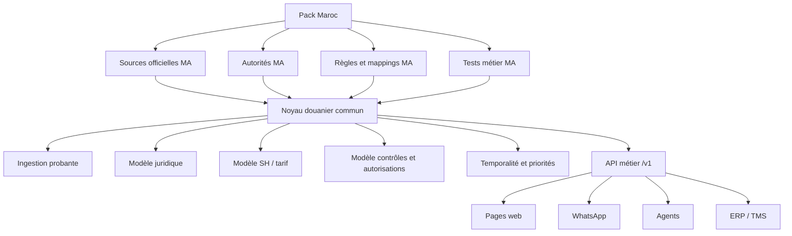

# Audit sources et obligations — pack Maroc

Statut : brouillon de cadrage avant gel du périmètre V1. Dernière mise à jour :
27 septembre 2026.

Ce document définit ce que le cerveau douanier doit couvrir pour le Maroc sans
coder le Maroc en dur dans le noyau. Le noyau reste générique ; le pack Maroc
apporte les sources, autorités, jeux de données, priorités, règles et tests de
juridiction.

## Décision d'architecture

Le produit ne doit pas être un chatbot branché sur quelques PDF. Il doit être un
cerveau douanier headless composé de deux couches :

1. **Noyau douanier commun** : ingestion, preuve, versioning, graphe,
   temporalité, priorités normatives, API, agents, sécurité, audit, réponse
   sourcée et statut d'incertitude.
2. **Pack Maroc** : sources marocaines, autorités, documents, listes de produits,
   règles applicables, accords, taxes, contrôles, autorisations, procédures et
   tests métier.

Aucune règle telle que `if country = MA then ...` ne doit être dispersée dans les
pages, agents ou services. Les règles Maroc sont des données et configurations du
pack `MA`.



## Registre initial des sources officielles

| Priorité | Source | Organisme | Données nécessaires | Format observé | Automatisation probable | Rôle dans le cerveau |
| ---: | --- | --- | --- | --- | --- | --- |
| P0 | [Tarif / ADIL / tarif intégré](https://www.douane.gov.ma/web/guest/tarif#https://www.douane.gov.ma/tarif/tarif/init.jsf?) | ADII | SH national, droits, taxes, documents, normes, avantages tarifaires | JSF, pages web, PDF, liens documentaires | Partielle : accès web complexe, certains liens PDF directs ; téléchargement contrôlé + validation | Base SH/tarif Maroc |
| P0 | [Bases législatives et réglementaires ADII](https://www.douane.gov.ma/web/guest/nos-bases-legislatives-et-reglementaires) | ADII | Code des douanes, RDII, textes de référence, circulaires | Pages web + documents PDF/HTML | Partielle : pages avec rejets possibles, documents directs parfois accessibles | Base juridique douanière |
| P0 | Circulaires ADII, exemples PDF ADIL [`5740.PDF`](https://www.douane.gov.ma/adil/PDF/5740.PDF), [`5693.PDF`](https://www.douane.gov.ma/adil/PDF/5693.PDF), [`5558.pdf`](https://www.douane.gov.ma/adil/pdf/5558.pdf) | ADII | Lois de finances, changements tarifaires, TIC, TVA import, exemptions, décisions anticipées | PDF | Oui pour URLs connues ; découverte complète à fiabiliser | Mises à jour et impact réglementaire |
| P0 | [PortNet Commerce Extérieur](https://www.portnet.ma/portnet-commerce-exterieur) | PortNet | Procédures import/export, demandes d'autorisation, échange résultats de contrôle avec douane | Portail, guides PDF, pages | Partielle : guides téléchargeables ; transactions protégées | Parcours opérationnel et statuts dossier |
| P0 | [Documents et services MIC](https://mcinet.gov.ma/fr/content/documents-et-services-en-ligne) | Ministère Industrie et Commerce | Listes produits contrôlés à l'origine/arrivée, réglementations techniques, OEC, circulaires | Pages + PDF/Excel potentiels | Oui via page documents + fichiers | Contrôles industriels et conformité |
| P0 | [Surveillance du marché MIC](https://www.mcinet.gov.ma/fr/content/qualite-et-surveillance-des-marches/surveillance-du-march%C3%A9) | Ministère Industrie et Commerce | Loi 24-09, marquage Cم, contrôle à l'importation, organismes d'inspection | Pages + documents | Oui pour pages/documents | Autorisations et conformité produits industriels |
| P0 | [Liste marchandises soumises à licence d'importation](https://www.mcinet.gov.ma/fr/content/liste-des-marchandises-soumises-licence-dimportation-0) et [arrêté 1308-94](https://mcinet.gov.ma/sites/default/files/Arretes/Arrete1308-94_218.pdf) | Ministère Industrie et Commerce | Codes nomenclature soumis à licence, restrictions quantitatives import/export | PDF/tableaux | Oui, extraction tableau nécessaire | Autorisations/licences import-export |
| P0 | [Liste des produits industriels contrôlés à l'importation](https://www.mcinet.gov.ma/sites/default/files/liste%20des%20produits%20controles%20a%20limportation%20au%20maroc.pdf) | Ministère Industrie et Commerce | Produits contrôlés, normes/réglementations obligatoires, indices normes | PDF/tableaux bilingues | Oui, extraction tableau + normalisation | Contrôle technique industriel |
| P0 | [ONSSA contrôle import/export](https://www.onssa.gov.ma/controle-a-limportation-et-a-lexportation/) | ONSSA | Produits alimentaires, animaux, végétaux, intrants, aliments animaux, contrôle sanitaire/phytosanitaire | Pages + PDF + modèles certificats | Oui pour pages/documents ; modèles par pays à crawler | Sanitaire, phytosanitaire, certificats |
| P0 | [ONSSA procédure produits animaux](https://www.onssa.gov.ma/controle-a-limportation-et-a-lexportation/importation-des-produits-alimentaires-2/produits-animaux/procedures-dimportation/) | ONSSA | Procédure contrôle import, admission/non admission, documents | Pages | Oui | Parcours contrôle sanitaire import |
| P0 | [ONSSA procédure produits végétaux](https://www.onssa.gov.ma/controle-a-limportation-et-a-lexportation/importation-des-produits-alimentaires-2/produits-vegetaux/procedure-de-controle/) | ONSSA | Contrôle produits végétaux, documents spécifiques, arrêtés | Pages | Oui | Parcours contrôle phytosanitaire |
| P0 | [AMMPS ligne directrice médicaments import/export](https://www.ammps.gov.ma/note-information/publication-de-la-ligne-directrice-relative-a-limportation-et-a-lexportation-des-medicaments-a-usage-humain) | AMMPS | Médicaments, AMM, autorisations spécifiques, CLV, CPP | Page + document | Oui, source récente à intégrer | Produits de santé |
| P0 | [Santé — réglementation produits de santé](https://www.sante.gov.ma/Reglementation/Pages/REGLEMENTATION-APPLICABLE-AU-PRODUITS-DE-SANTE.aspx) | Santé / AMMPS | Code médicament, circulaires, dispositifs médicaux | Pages + documents | Oui | Produits de santé et dispositifs médicaux |
| P0 | [ANRT agréments équipements](https://www.anrt.ma/ar/e-services/agrements-des-equipements) | ANRT | Agrément équipements télécom/radio, autorisations, liste équipements agréés | Pages + service | Partielle : portail/liste à analyser | Télécom, Wi-Fi, Bluetooth, radio |
| P0 | [Décision ANRT 16/24](https://www.anrt.ma/sites/default/files/2025-04/Decision-Agrement-16-24-Ver-exploitable-FR.pdf) | ANRT | Procédure agrément, validité agrément/autorisation, documents | PDF exploitable | Oui | Règles télécom et conformité |
| P0 | [Office des Changes — réglementations](https://www.oc.gov.ma/fr/reglementations?field_categorie_reglementation_target_id=40&field_thematique_value=All) | Office des Changes | IGOC, paiements, import/export, rapatriement recettes export | Pages + PDF | Oui | Obligations de change et paiement |
| P0 | [IGOC 2026](https://www.oc.gov.ma/sites/default/files/2026-01/IGOC%202026_1.pdf) | Office des Changes | Instruction générale opérations de change | PDF | Oui | Règles financières import/export |
| P1 | [IMANOR normes](https://www.imanor.gov.ma/normes/) | IMANOR | Catalogue normes marocaines, indices, normes obligatoires, certifications | Pages/catalogue | Partielle : catalogue consultable, accès à vérifier | Normes et conformité technique |
| P1 | [IMANOR marquage Cم](https://www.imanor.gov.ma/marquage-c/) | IMANOR | Marquage conformité produits industriels, exigences loi 24-09 | Page | Oui | Preuves conformité produits industriels |
| P1 | [Morocco Foodex contrôle technique](https://www.moroccofoodex.org.ma/fr/controle-technique-des-produits/) | Morocco Foodex | Procédures export agroalimentaire, certificats, contrôle analytique | Pages + formulaires | Oui | Export agroalimentaire |
| P1 | [Morocco Foodex guides et procédures](https://www.moroccofoodex.org.ma/fr/autorite-de-controle/guides-et-procedures/) | Morocco Foodex | Guides export, réglementations commerciales, normes techniques | Pages + documents | Oui | Parcours export agroalimentaire |
| P1 | [AMSSNuR PortNet-SIGAM](https://amssnur.org.ma/la-demarche-pour-loctroi-des-autorisations-dimportation-des-sources-de-rayonnements-ionisants-et-lechange-des-resultats-de-controle-desormais-100-digitale-via-portnet-sigam/) | AMSSNuR | Importation sources rayonnements ionisants, résultats contrôle | Page + PortNet/SIGAM | Partielle : formulaires/guides oui, transaction protégée | Produits radioactifs/radiologiques |
| P1 | [AMSSNuR formulaires](https://amssnur.org.ma/formulaires/?lang=en) | AMSSNuR | Formulaires autorisations sources radioactives | Pages + documents | Oui | Autorisations AMSSNuR |
| P1 | [PortNet processus céréales/ONICL](https://portail-test.portnet.ma/ar/gestion-processus-importation-cereales-legumineuse) | PortNet / ONICL | Récépissés céréales et légumineuses, autorisations | Page/portail | Partielle | Céréales, légumineuses |
| P1 | [Circulaire ONICL céréales](https://www.fncl.ma/download/128/circulaires-onicl/7683/circulaire-n1-dc-sie-du-13-01-2012-modalites-importation-et-dexportation-cereales-legumineuses-et-leurs-produits-derives.pdf) | ONICL | Déclaration initiale import/export, délais avant douane | PDF | Oui, source secondaire à confirmer par ONICL | Produits céréaliers |
| P1 | [Substances chimiques — environnement](https://www.environnement.gov.ma/fr/service/mouvements-transfrontaliers-des-dechets-et-des-produits-chimiques?catid=83&id=386%3Atransfert-des-substances-chimiques&view=article) | Département Environnement | Convention Rotterdam, autorisations import/export substances chimiques | Page + listes | Oui | Produits chimiques réglementés |
| P1 | [OMD HS 2022](https://www.wcoomd.org/en/topics/nomenclature/instrument-and-tools/hs-nomenclature-2022-edition) | OMD/WCO | SH international, notes légales, éditions, amendements | Pages, outils sous licence | Partielle/licence | Couche internationale SH |
| P1 | [WCO Trade Tools](https://www.wcotradetools.org/) | OMD/WCO | SH, notes explicatives, opinions de classement, règles d'origine | Plateforme/licence/API | Selon licence | Référence internationale classement |
| P2 | [TARIC UE](https://taxation-customs.ec.europa.eu/online-services/online-services-and-databases-customs/eu-customs-tariff-taric_en) | Commission européenne | Tarif UE, mesures CCT, législation commerciale/agricole | Base multilingue | Oui selon flux/offres EC | Extension future UE/comparaison |

## Obligations métier à couvrir pour le Maroc

Le cerveau Maroc doit répondre au moins aux familles d'obligations suivantes :

| Domaine | Questions utilisateur à couvrir | Sources principales | Données structurées à extraire |
| --- | --- | --- | --- |
| Classement SH | Quel code SH probable pour ce produit ? Quels chapitres/positions/sous-positions ? | ADII tarif, OMD/WCO | hiérarchie SH, notes, libellés, règles interprétatives, preuves |
| Droits et taxes | Quels droits, TVA import, TIC, taxes, préférences ? | ADII tarif, circulaires, lois finances, CGI/TIC | taux, assiette, conditions, exemptions, dates, origine |
| Documents douaniers | Quels documents préparer ? DUM, titre, facture, certificat, preuve conformité ? | ADII, PortNet, MIC, ONSSA, AMMPS, ANRT | type document, obligatoire/conditionnel, organisme, canal, statut |
| Licences import/export | Produit soumis à licence ? Quelle autorité ? | MIC, arrêtés, PortNet | code SH, désignation, licence, base juridique, durée, procédure |
| Contrôle technique industriel | Contrôle origine ou arrivée ? Certificat conformité ? Marquage Cم ? | MIC, IMANOR, OEC | produit, norme obligatoire, organisme, schéma contrôle, certificat |
| Sanitaire/phytosanitaire | Produit alimentaire/animal/végétal soumis à contrôle ? Certificat ? | ONSSA | catégorie produit, documents, PIF, contrôle documentaire/identité/physique, admission/refoulement |
| Médicaments/santé | AMM, autorisation spécifique, dispositif médical, don, CLV/CPP ? | AMMPS, Santé | produit santé, régime, autorisation, documents, exceptions |
| Télécom/radio | Équipement soumis agrément ANRT ? | ANRT, PortNet | famille équipement, agrément, validité, autorisation, preuve |
| Radiologique/nucléaire | Source ionisante ou équipement contrôlé ? | AMSSNuR, PortNet | type source, autorisation, contrôle, paiement, résultats |
| Céréales/légumineuses | Récépissé ONICL ou déclaration préalable ? | ONICL/PortNet | produit, délai, déclaration, récépissé, autorité |
| Agro export | Certificat conformité, contrôle technique/analytique ? | Morocco Foodex, ONSSA | produit, destination, certificat, instruction, procédure |
| Change et paiement | Modalités de règlement, rapatriement export, devises ? | Office des Changes | obligation financière, délai, justificatifs, banque, IGOC version |
| Origine et accords | Origine préférentielle ? Accord applicable ? Preuve d'origine ? | ADII, accords, OMD/WCO, PortNet | pays, accord, règle origine, justificatif, taux préférentiel |
| Procédure PortNet/BADR | Où faire la demande et quel statut suivre ? | PortNet, ADII | service, canal, étapes, statuts, pièces jointes, acteur responsable |
| Risques et sanctions | Que se passe-t-il si non-conformité ? | ADII, MIC, ONSSA, ANRT, AMSSNuR | infraction, sanction, refoulement, saisie, régularisation |

## Modèle générique requis

Pour éviter un cerveau codé uniquement pour le Maroc, chaque obligation doit être
modélisée sous forme commune :

```text
jurisdiction_pack
  source_catalog
  authority_catalog
  legal_instrument
  legal_version
  legal_provision
  hs_nomenclature
  hs_node
  regulatory_measure
  required_document
  authorization_requirement
  control_requirement
  procedure_step
  business_rule
  temporal_rule
  evidence
  quality_status
```

### Entités minimales

- `authority` : organisme, rôle, juridiction, canal, URL, dépendances.
- `source_notice` : page ou fichier officiel, date d'observation, fréquence,
  stratégie de mise à jour, licence, fiabilité.
- `legal_instrument/version/provision` : hiérarchie, date, validité, abrogation,
  modification, source.
- `hs_node` : code, libellé, niveau, édition, juridiction, parent, source.
- `regulatory_measure` : droit, taxe, licence, contrôle, autorisation,
  interdiction, exemption, document requis, procédure, sanction.
- `applicability_condition` : produit, code SH/prefixe, origine, destination,
  usage, régime, quantité, acteur, date, canal.
- `procedure_step` : action, autorité, canal, documents, délai, statut.
- `evidence` : page, zone, extrait, version, score, méthode, statut.

## Priorités V1 Maroc après audit

Avant de figer la V1, les P0 doivent être couverts. Les P1 peuvent être intégrés
par lots si le temps le permet.

### P0 obligatoire

1. ADII : tarif, SH, droits/taxes, documents/normes ADIL.
2. ADII : Code des douanes, RDII, circulaires, lois de finances pertinentes.
3. MIC : licences import/export, produits industriels contrôlés, normes
   obligatoires, loi 24-09, marquage Cم.
4. ONSSA : produits alimentaires, animaux, végétaux, intrants, aliments animaux.
5. PortNet : procédure import/export et demandes d'autorisation comme canal
   opérationnel, au moins au niveau informationnel.
6. AMMPS/Santé : produits de santé et médicaments.
7. ANRT : équipements télécom/radio.
8. Office des Changes : règles financières import/export.
9. WCO/OMD : base internationale SH et règles d'interprétation, selon accès ou
   licence.

### P1 à intégrer ensuite

- AMSSNuR pour sources ionisantes.
- Morocco Foodex pour export agroalimentaire.
- ONICL pour céréales/légumineuses.
- Environnement pour substances chimiques et déchets.
- IMANOR catalogue normes détaillé.
- Accords bilatéraux et règles d'origine par pays.

## Gap analysis par rapport au code actuel

| Besoin | État actuel | Gap |
| --- | --- | --- |
| Provenance et déduplication | Solide : SHA-256, documents, pages, source assets | Ajouter registre officiel de sources externes surveillées par organisme |
| Juridique ADII | Début solide sur Code des douanes : provisions validées et premières relations | Étendre RDII, circulaires, lois de finances ; compléter dates et textes cibles |
| SH/tarif | Modèle et worker posés ; candidats SH existants | Exécuter et valider extraction tableaux tarifaires, taux, unités, documents/normes |
| Licences MIC | Non intégré comme faits canoniques | Ingestion listes licences et produits contrôlés, extraction codes SH, normes |
| ONSSA | Non intégré comme faits canoniques | Connecter catégories produits/documents/procédures/certificats |
| PortNet | Documenté comme canal, pas modélisé dans le cerveau | Modéliser procédures, statuts, services, pièces jointes ; pas d'automatisation transactionnelle sans accès/API |
| AMMPS/ANRT/Office changes | Non intégré | Créer authorities, sources, requirements et procédures |
| Graphe contexte | Début : 10 relations juridiques proposées | Ajouter liens SH-provision-mesure-document-autorité-procédure |
| Temporalité | Prévue, non complète | Compiler règles par date applicable, version, abrogation, modification |
| Réponse API | Prévue, non stable | Attendre P0 data + mesures avant contrat final `/v1` |
| WhatsApp/pages | Obligatoire documenté | À construire après API stable |

## Risques identifiés

- Les sites officiels marocains publient souvent en PDF, pages JSF ou portails
  avec rejet de requête ; il faut prévoir téléchargement contrôlé, cache et
  validation de provenance.
- Les listes de produits sont souvent des tableaux PDF bilingues ou scannés ; la
  qualité d'extraction doit être mesurée code par code.
- ADIL/PortNet contiennent des informations opérationnelles mais certaines parties
  sont transactionnelles ou protégées ; la V1 doit d'abord modéliser les règles et
  procédures, pas exécuter les formalités à la place de l'opérateur.
- Le SH international OMD et les notes explicatives peuvent nécessiter licence ;
  ne pas intégrer de contenu sous licence sans droit d'utilisation.
- Une source officielle ne garantit pas une extraction correcte : chaque fait doit
  conserver preuve, score, statut et version.

## Recommandation avant gel V1

Ne pas figer le scope final tant que les éléments suivants ne sont pas ajoutés au
backlog V1 :

1. registre officiel des sources P0 ;
2. ingestion des listes MIC contrôles/licences ;
3. ingestion ONSSA au moins par familles produits et procédures ;
4. intégration ANRT, AMMPS et Office des Changes au niveau obligations ;
5. extension du modèle `regulatory_measures` pour couvrir autorisation, contrôle,
   document, procédure, sanction et canal ;
6. moteur de résolution `product + operation + origin + date -> obligations` ;
7. benchmark par scénarios réels : électronique Wi-Fi, produit alimentaire,
   médicament, produit industriel normé, céréale, produit soumis licence,
   export agroalimentaire.

Une V1 Maroc sérieuse doit donc être définie comme :

> SH/tarif + juridique ADII + contrôles/licences MIC + sanitaire ONSSA + santé
> AMMPS + télécom ANRT + change Office des Changes + procédures PortNet + réponse
> API sourcée + WhatsApp + pages refondues.

