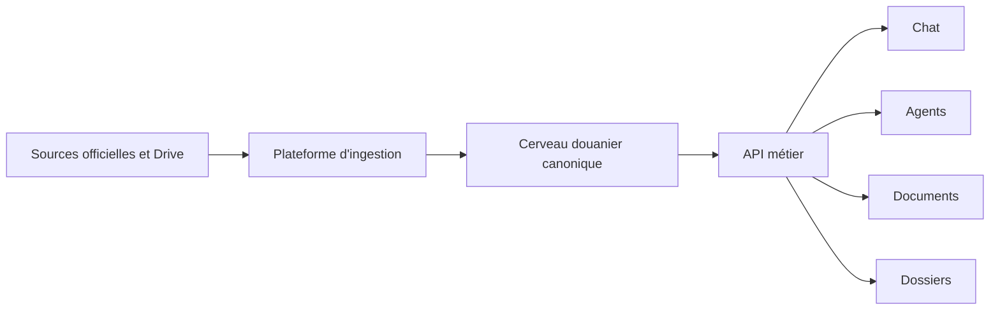

# Architecture du cerveau douanier

Ce dossier est la source de vérité pour le développement de Douane AI.

| Document | Rôle |
| --- | --- |
| `PRODUCT_REQUIREMENTS.md` | Les dix exigences validées et leurs critères d'acceptation |
| `CURRENT_STATE.md` | Mesures réelles, limites et état déployé |
| `TARGET_ARCHITECTURE.md` | Architecture finale et séparation des responsabilités |
| `INGESTION_PIPELINE.md` | Étapes, reprises, extraction et boucle de mise à jour |
| `CANONICAL_DATA_MODEL.md` | Entités canoniques SH, juridiques et réglementaires |
| `QUALITY_GATES.md` | Définition mesurable de la fiabilité et seuils de publication |
| `IMPLEMENTATION_PLAN.md` | Chantiers, ordre d'exécution et critères de fin |
| `COUNTRY_PACKS.md` | Noyau international et extensions par juridiction |
| `CHANNELS_AND_INTEGRATIONS.md` | API plug-and-play, agents, web, WhatsApp et ERP |
| `DELIVERY_ESTIMATE.md` | Phases et estimation de livraison du pack Maroc |
| `decisions/` | Décisions d'architecture difficiles à inverser |

## Objectif

Construire un cerveau douanier versionné et sourcé qui répond à la question :

> Pour ce produit, cette opération, ce pays et cette date, quelles classifications,
> taxes, autorisations, règles et pièces sont applicables, et quelles preuves
> officielles les justifient ?

Les interfaces consomment le cerveau au moyen d'une API métier. Le chat et les
agents ne lisent pas directement les PDF et ne décident pas seuls du droit
applicable.

La cible validée est un monolithe modulaire : noyau commun, packs réglementaires
par juridiction, workers durables, API unique et adaptateurs de canaux. Le Maroc
est le premier pack national complet.

## Règle de priorité documentaire

En cas de contradiction :

1. contraintes et migrations exécutées dans la base ;
2. ce dossier `docs/architecture/` ;
3. tests automatisés ;
4. anciens documents généraux dans `docs/` ;
5. texte d'interface.
