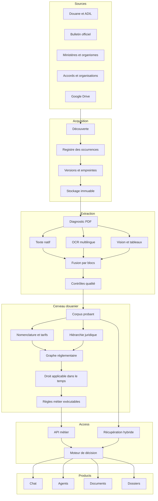

# Architecture cible

## Couches

## Séparation des responsabilités

- **Acquisition** constate qu'une ressource existe et conserve ses versions.
- **Extraction** reconstruit fidèlement le contenu visible sans interpréter le droit.
- **Normalisation** transforme les résultats en entités métier candidates.
- **Cerveau** consolide les versions, relations, périodes et règles applicables.
- **Moteur de décision** combine des faits publiés pour un contexte donné.
- **LLM** reformule, explique, demande les informations manquantes et cite les preuves.

## Services cibles

1. `source-discovery-worker`
2. `document-ingestion-worker`
3. `ocr-and-layout-worker`
4. `tariff-extractor`
5. `legal-structure-extractor`
6. `context-graph-builder`
7. `quality-evaluator`
8. `publication-compiler`
9. `customs-brain-api`

Les workers communiquent par des tâches durables avec idempotence, tentatives,
dead-letter queue et métriques. Vercel sert l'application et les API courtes ; les
traitements PDF longs s'exécutent dans un worker durable séparé. Supabase reste le
registre transactionnel, le stockage probant et la base du graphe métier.

