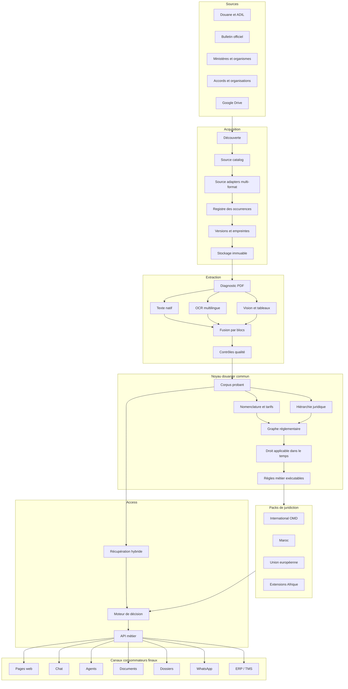

# Architecture cible

## Couches

```mermaid
flowchart TB
  subgraph Sources
    D[Douane et ADIL]
    BO[Bulletin officiel]
    M[Ministères et organismes]
    A[Accords et organisations]
    GD[Google Drive]
  end
  subgraph Acquisition
    DISC[Découverte]
    SCAT[Source catalog]
    ADAPT[Source adapters multi-format]
    REG[Registre des occurrences]
    VER[Versions et empreintes]
    RAW[Stockage immuable]
  end
  subgraph Extraction
    PDF[Diagnostic PDF]
    TXT[Texte natif]
    OCR[OCR multilingue]
    VIS[Vision et tableaux]
    MERGE[Fusion par blocs]
    QA[Contrôles qualité]
  end
  subgraph Brain["Noyau douanier commun"]
    EVI[Corpus probant]
    HS[Nomenclature et tarifs]
    LAW[Hiérarchie juridique]
    GRAPH[Graphe réglementaire]
    TIME[Droit applicable dans le temps]
    RULES[Règles métier exécutables]
  end
  subgraph Packs["Packs de juridiction"]
    INT[International OMD]
    MA[Maroc]
    EU[Union européenne]
    AF[Extensions Afrique]
  end
  subgraph Access
    API[API métier]
    RET[Récupération hybride]
    DEC[Moteur de décision]
  end
  subgraph Consumers["Canaux consommateurs finaux"]
    WEB[Pages web]
    CHAT[Chat]
    AGENT[Agents]
    DOC[Documents]
    CASE[Dossiers]
    WA[WhatsApp]
    ERP[ERP / TMS]
  end
  Sources --> DISC --> SCAT --> ADAPT --> REG --> VER --> RAW --> PDF
  PDF --> TXT --> MERGE
  PDF --> OCR --> MERGE
  PDF --> VIS --> MERGE
  MERGE --> QA --> EVI
  EVI --> HS
  EVI --> LAW
  HS --> GRAPH
  LAW --> GRAPH --> TIME --> RULES
  RULES --> Packs
  Packs --> DEC
  EVI --> RET --> DEC
  DEC --> API
  API --> WEB
  API --> CHAT
  API --> AGENT
  API --> DOC
  API --> CASE
  API --> WA
  API --> ERP
```

## Séparation des responsabilités

- **Acquisition** constate qu'une ressource existe et conserve ses versions.
- **Extraction** reconstruit fidèlement le contenu visible sans interpréter le droit.
- **Normalisation** transforme les résultats en entités métier candidates.
- **Cerveau** consolide les versions, relations, périodes et règles applicables.
- **Moteur de décision** combine des faits publiés pour un contexte donné.
- **API métier** expose les résultats du moteur sous contrats versionnés.
- **Canaux consommateurs** collectent la demande, présentent la réponse et
  conservent le parcours utilisateur ; ils ne décident pas du droit applicable.
- **LLM** reformule, explique, demande les informations manquantes et cite les preuves.
- **Pack de juridiction** ajoute les extensions SH, textes, mesures,
  administrations, procédures et priorités nationales sans modifier le noyau.

## Services cibles

1. `source-discovery-worker`
2. `source-adapter-worker`
3. `document-ingestion-worker`
4. `ocr-and-layout-worker`
5. `tariff-extractor`
6. `legal-structure-extractor`
7. `obligation-extractor`
8. `context-graph-builder`
9. `quality-evaluator`
10. `publication-compiler`
11. `customs-brain-api`
12. `channel-adapters`

Les workers communiquent par des tâches durables avec idempotence, tentatives,
dead-letter queue et métriques. Vercel sert l'application et les API courtes ; les
traitements PDF longs s'exécutent dans un worker durable séparé. Supabase reste le
registre transactionnel, le stockage probant et la base du graphe métier.

Le démarrage reste un monolithe modulaire. Un service n'est séparé physiquement
que lorsque sa charge, son cycle de déploiement ou son isolation l'exige.

La construction des pages métier est volontairement placée après l'API du
cerveau. Les écrans web existants peuvent rester disponibles pour consultation ou
administration, mais toute nouvelle expérience utilisateur finale doit consommer
les contrats `/v1` au lieu d'accéder directement aux tables ou de réimplémenter de
la logique métier.

## Impact de l’audit V1 Maroc

Le source catalog et les adapters multi-format deviennent des couches obligatoires. Le pipeline ne traite plus uniquement des PDF : il doit accepter pages web, PDF juridiques, PDF tableaux, fichiers tabulaires, guides de procédure et sources manuelles versionnées. Les données Maroc restent dans le pack `MA`; le noyau conserve uniquement le modèle générique, les preuves, l’orchestration, la temporalité et les contrats.
